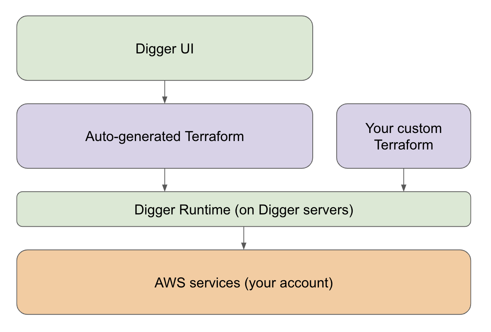

# Introduction to Digger

What is Digger? Digger generates Infrastructure for your code (IaC) and manages your AWS account. It does so using Terraform (the industry standard for all things DevOps) which is customisable.

Therefore, unlike PaaS providers such as Heroku and Vercel that run your code on their server, you will never outgrow Digger as your organisation scales.

## How Digger works?

Digger manages your AWS account through infrastructure-as-code that it automatically generates.

### Your AWS account

Digger is not a PaaS - it does not run your code and does not store your application data on Digger servers. Instead, it assembles your stack from the building blocks provided by Amazon in your AWS account, in the exact same way a DevOps engineer would have done it. This is a much more reliable and future-proof way because you retain access to the full range of AWS services and their customer support. It is also way cheaper.

### Infrastructure-as-code generation

Changes you make in Digger UI like adding apps or changing settings are translated into Terraform, an infrastructure-as-code language created by Hashicorp. It is open-source and is the most popular tool amongst DevOps community. You can download the auto-generated Terraform, and even set up two-way sync with your GitHub.

### Server-side runtime

Terraform generation, `plan` and `apply` is run on Digger servers, a bit like Terraform Cloud. The state is managed centrally in a dedicated S3 bucket. Digger runtime also takes care of deploying your application code. You can think of Digger runtime as “CI for infrastructure” combined with the “last mile” of your conventional CI. “last mile” because Digger is not designed for running tests and other application-specific parts of your CI pipeline. There are great established tools for that - think GitHub Actions, CircleCI or GitLab.

### Custom Terraform

Digger does not limit you with the capabilities of its UI. Instead, Terraform is used as extensibility / customisation point. You can write your own custom Terraform and it will be picked up by the Digger Runtime alongside the auto-generated code. This means that full range of AWS services is supported - if it works in Terraform, it works in Digger.
