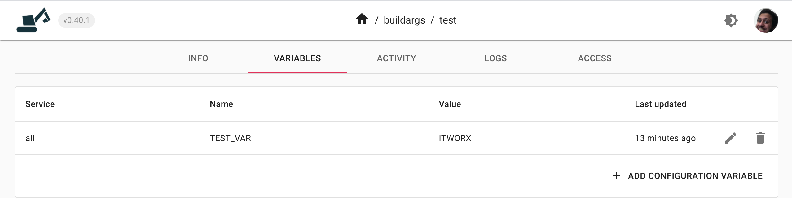

# Environmental variables during build

In some cases it is required to expose environment variables defined in the web UI during container builid time. For example in a NUXT.js project environment variables are needed to be present during build time. This is currently supported by enabling it manually. If you would like to enable it for your environment please contact us via intercom and we can enable it for you. This document is a quick example on how you can acheive this for the container service type.

Here is an example dockerfile. Note the following Dockerfile contents:

```dockerfile
FROM alpine:latest
ARG TEST_VAR=default
RUN echo $TEST_VAR
```

In this case we inject a variable called `TEST_VAR` into the container. We use a value of default for it. Note that you need to use the `ARG` keyword for each variable you want to inject in the dockerfile.

Now we can specify the argument in the environment as follows:



During the docker build process, we can access the variable as an env variable. It will work similarly when a build is triggered from the web UI as well:\


