# Deploy a sample application

This tutorial shows you how to deploy a sample node application with digger. The repository we would like to deploy is here: [https://github.com/diggerhq/a-nodeapp](https://github.com/diggerhq/a-nodeapp). If you prefer to watch a video instead please check out this loom:

## Prerequisites

Before starting the tutorial, please do the following:

* Create a [Digger](https://digger.dev/) account.
* Create an [AWS](https://aws.amazon.com/) account.
* Create a [GitHub](https://github.com/) account.
* Fork the [nodeapp repository](https://github.com/diggerhq/a-nodeapp).
* [Create an AWS user with administrator permissions](https://learn.digger.dev/misc/aws-keys.html)

## Deploying your first app

Let's try to deploy a simple node application as a container. In the first step we need to create a new project:

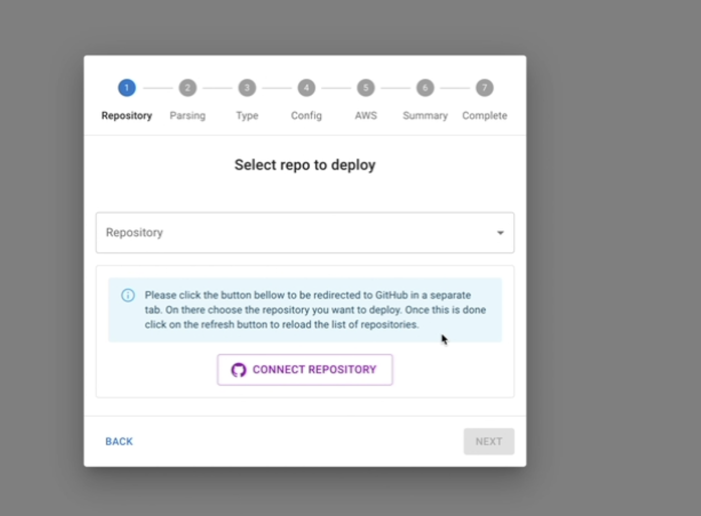

In order to load up our repoisory, we assume you have the sample repository forked. Click on connect with github. Select your personal account and authorize digger to access the repository:

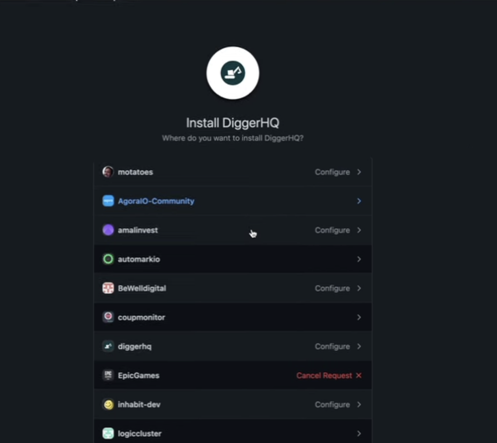

Select the nodeapp repository from the list:

&#x20;

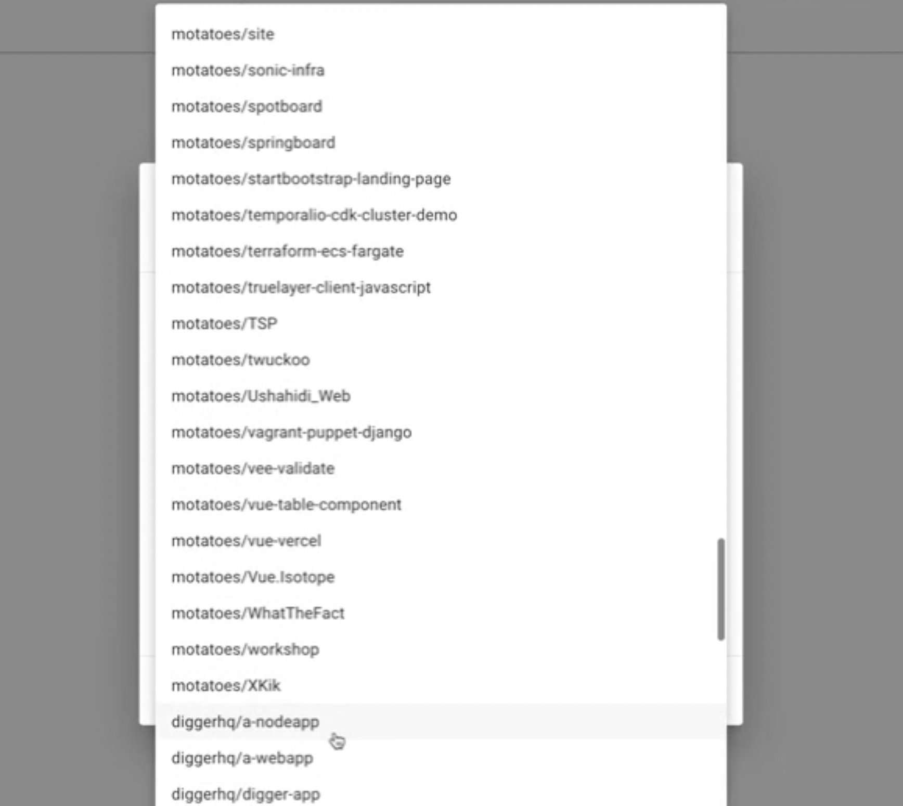

Wait for digger to detect the appropriate settings from your code:

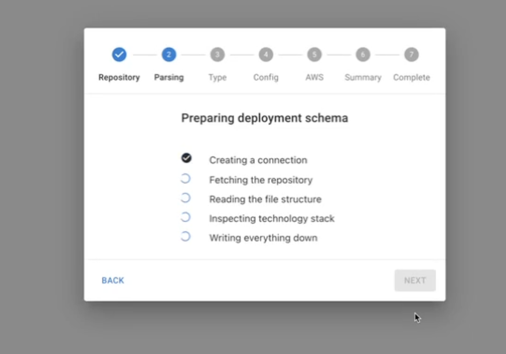

Digger correctly detects that this is a container application since there is a dockerfile present in the repository. Furthermore it has also detected the right port and healthcheck settings. Lets give it a name and click on 'next':&#x20;

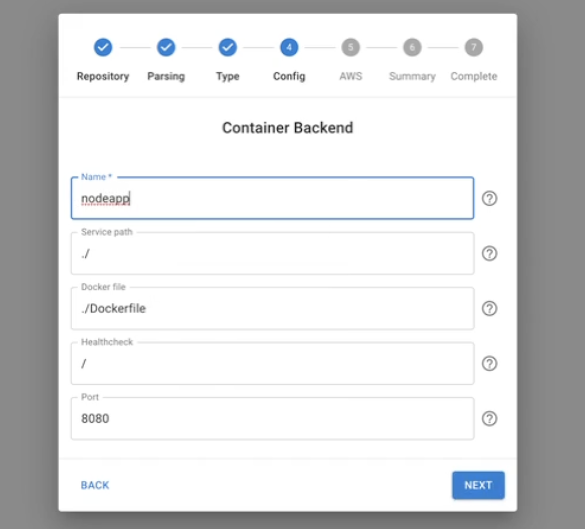

In the next step we need to connect to our AWS account. Click the button to connect to AWS and then login to our AWS account:

&#x20;

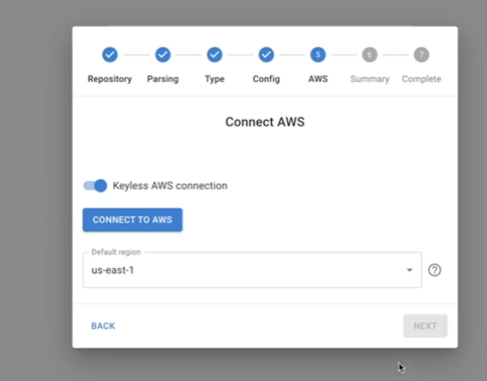

Lets deploy the cloudformation stack to authorize digger to connect to our account:&#x20;

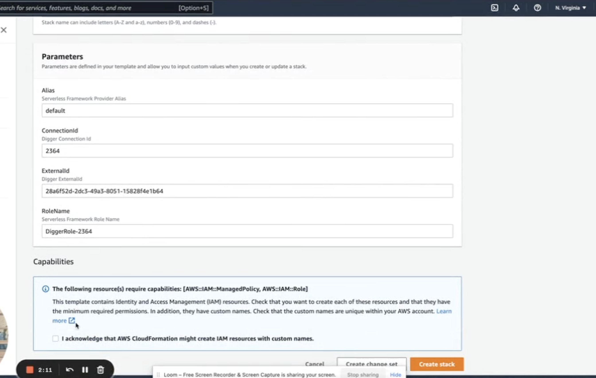

We wait for the cloudformation stack to be deployed:

&#x20;

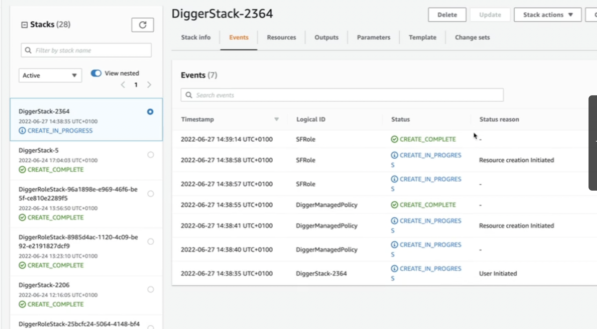

Now we return to the digger screen and click next:

&#x20;

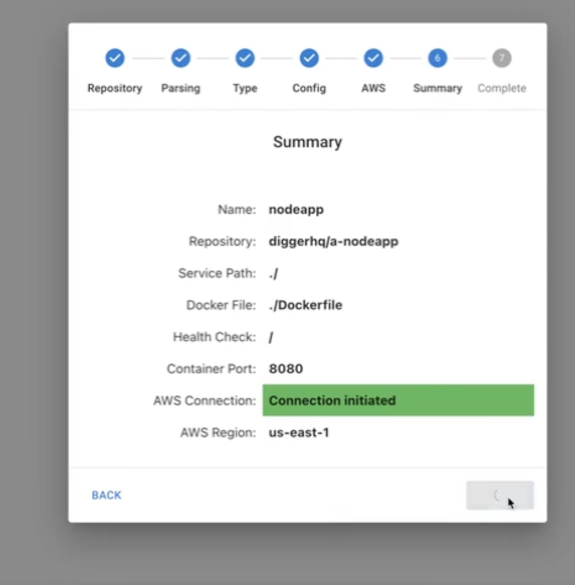

Let deploy:

&#x20;

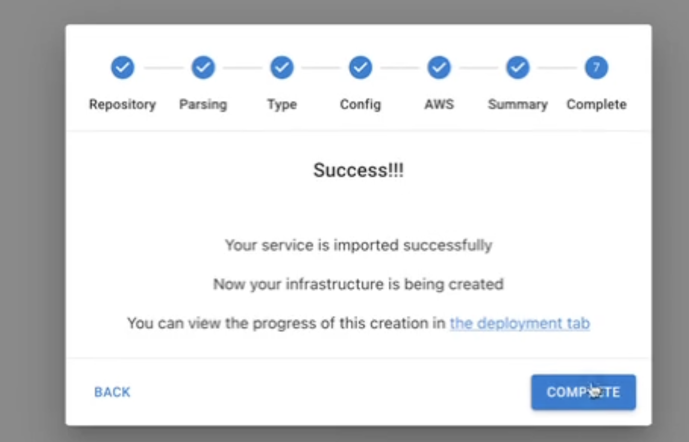

After compleition we see that the deployment started in a few moments. We have two jobs, the first steps up the infrastructure and the second job deploys our application. This step will take a few minutes so now would be a great time to grab a cup of coffee:&#x20;

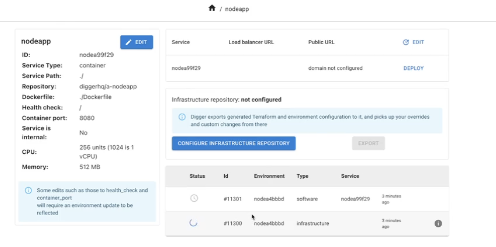

After a few moments the jobs are successful:

&#x20;

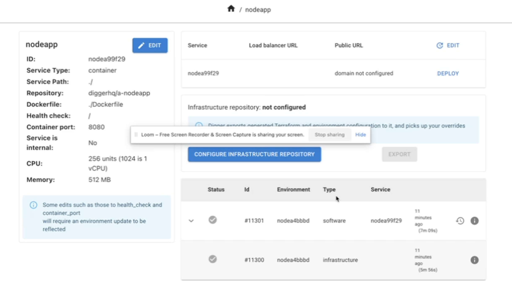

If we go into advanced mode > Environments > nodeapp then we will see our urls:&#x20;

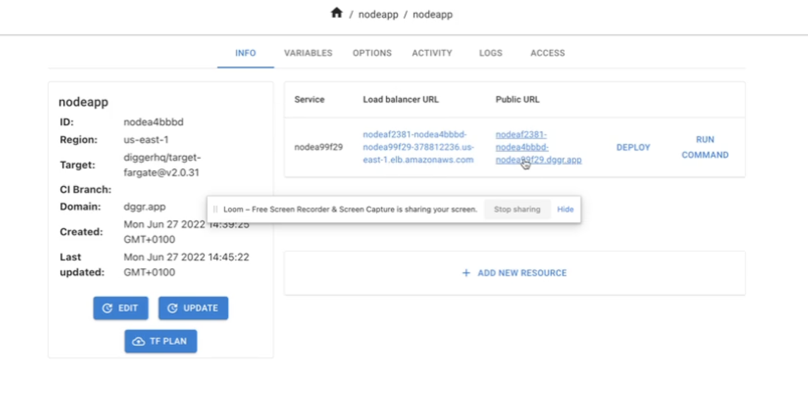

Click on one of the URLs and viola! We will see the digger splashscreen :)&#x20;

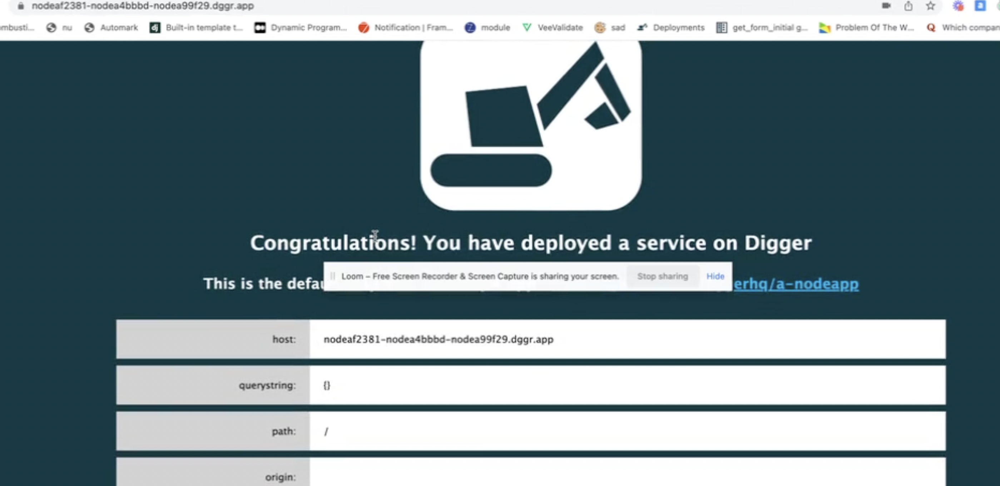

Congratulations on deploying your first stack with digger!

**Done!**

We've deployed our first application and got a working url. In the next part of this series we will look into assigning a custom domain to our application, creating resources such as databases, viewing our application logs and working with environments. Stay tuned!
