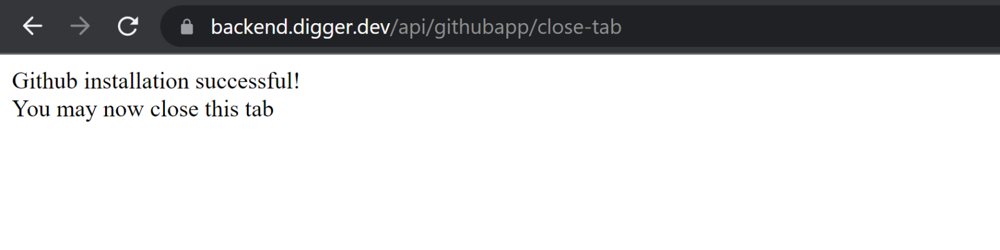
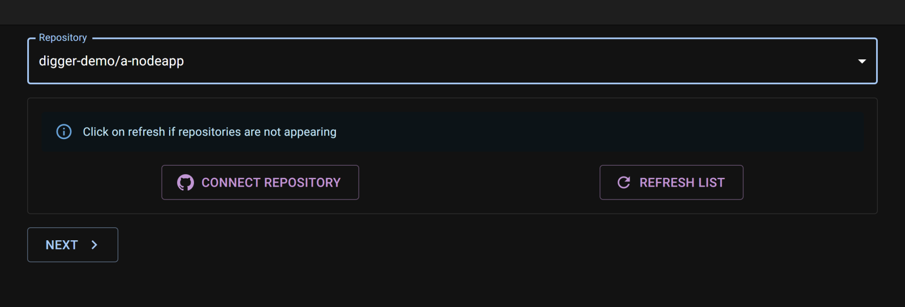
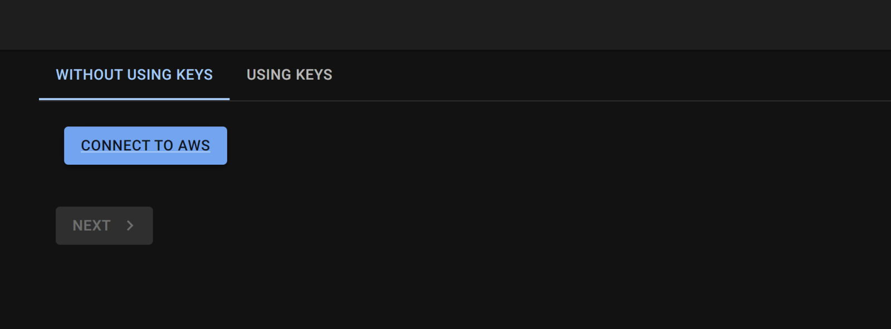
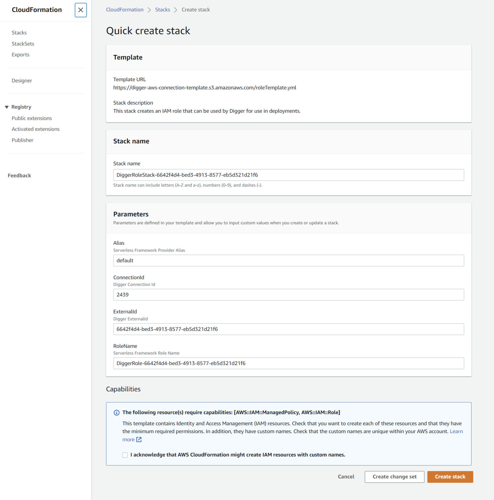
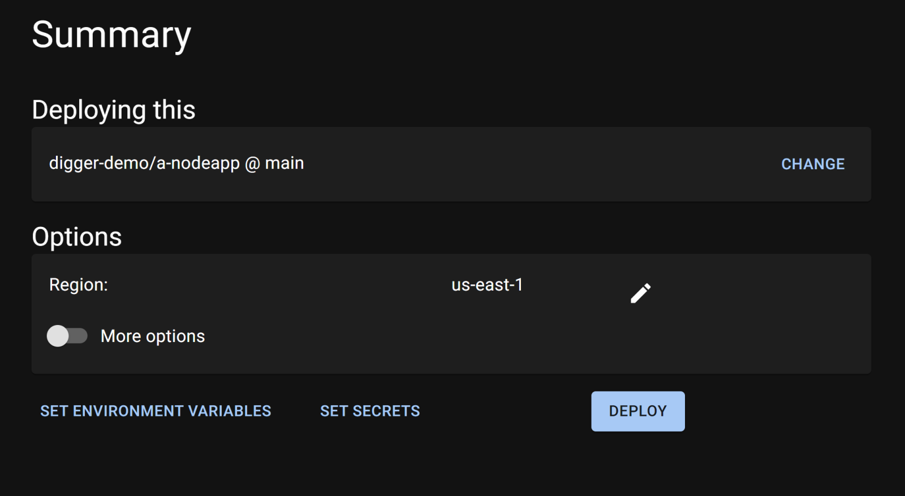

# 🚀 Deploy your first app

This tutorial shows you how to deploy a sample node application with digger. The repository we would like to deploy is here: [**https://github.com/diggerhq/a-nodeapp**](https://github.com/diggerhq/a-nodeapp) **(opens new window)**.

### **Prerequisites**

To be able to deploy an application with Digger you should have:

* GitHub account
* AWS account

### **Deploying your first app**

Let's try to deploy a simple node application as a container

#### Step 1: Login

Open [https://dashboard.digger.dev](https://dashboard.digger.dev) and log in with your GitHub account.

.png>)

.png>)

#### Step 2: link your GitHub repo

Click “Add from repository” button and allow digger to access the repo you want to deploy.

.png>)

.png>)

Close the authentication tab and press 'Refresh List'.&#x20;

A list of repositories should now be visible on the Dashboard.

Pick the repo you would like to deploy&#x20;

Click “Next”.

#### Step 4: Connect your AWS account

Digger's AWS account can connect directly to your AWS account, you don't need to share your keys. This is the easiest and the most secure way.

When “Connect to AWS” button clicked, you are redirected to AWS CloudFormation template that created a role and policy in your AWS account that allow Digger account to make changes

**-> Click the "Create Stack" button** at the bottom of the page. This may take a minute or two.

It's also possible (but not recommended) to connect with a key/secret pair. It can be needed in a federated setup. More information on how to do this can be found [here](https://learn.digger.dev/misc/aws-keys.html)

#### Step 5: deploy

Go back to Digger and click the “Next” button.

.png>)

Review the options before we click the “Deploy” button. Make changes if needed.

_Check: have you selected the correct branch name e.g. main?_

Some of the less frequently used options can be found under the "More options" toggle.

.png>)

When you're happy, press “Deploy”!&#x20;

It can take 5-7 minutes to deploy a container. In the meantime you can check logs and deployment progress - just click on “Infra” step

.png>)

.png>)

#### Step 6: Verify that your app works

Yay - the deployment is finished!

**-> Click the "Open App" button** to see it live

.png>)

.png>)

This is it! Your AWS account is fully configured and your app is live 🎉🎉🎉

## Appendix: permissions

Digger does not require administrator-level access to your AWS account. It only asks for permissions necessary to provision and run applications managed by Digger.

You can see which permissions are required during the AWS account connection step:

