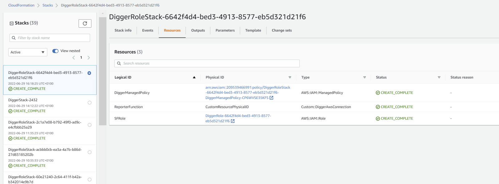
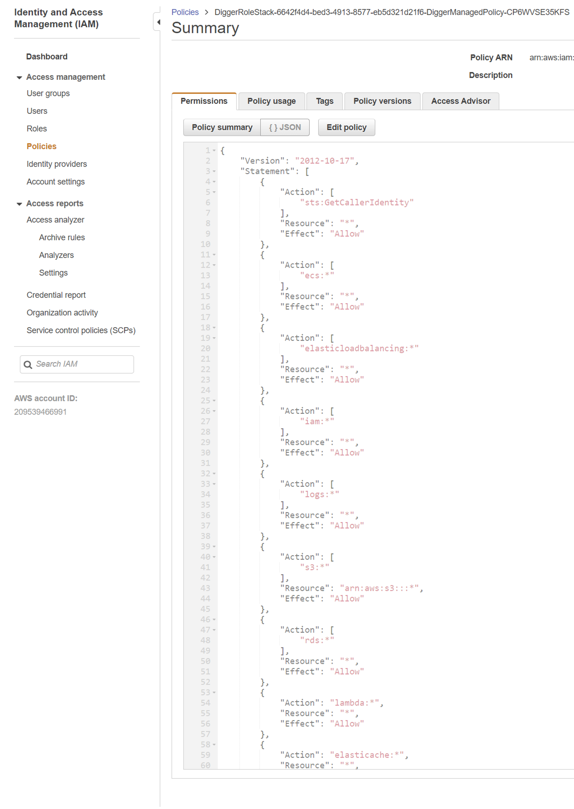

# 🚀 Deploy your first app

This tutorial shows you how to deploy a sample node application with digger. The repository we would like to deploy is here: [**https://github.com/diggerhq/a-nodeapp**](https://github.com/diggerhq/a-nodeapp) **(opens new window)**.

### **Prerequisites**

To be able to deploy an application with Digger you should have:

* GitHub account
* AWS account

### **Deploying your first app**

Let's try to deploy a simple node application as a container

#### Step 1: Login

Open [https://dashboard.digger.dev](https://dashboard.digger.dev) and log in with your GitHub account.

<figure><figcaption></figcaption></figure>

Authorize Digger HQ. At this point, Digger is only accessing your email ID for login.

.png>)

#### Step 2: Securely connect AWS Account

Press on the big orange tile that says "Press here to open AWS console Website"\

<figure><figcaption></figcaption></figure>

\
You will then be redirected to the AWS CloudFormation template that securely creates a role and policy in your AWS account which allows Digger's AWS account to make changes.

**-> Click the "Create Stack" button** at the bottom of the page. This may take a minute or two, before you can move to the next stage.\
\

<figure><figcaption></figcaption></figure>

Watch a video explainer [here](https://www.youtube.com/watch?v=KNmeK\_vhy1A).\
\
It's also possible (but not recommended) to connect with a key/secret pair. It can be needed in a federated setup. More information on how to do this can be found [here](https://learn.digger.dev/misc/aws-keys.html)

#### Step 3 : Link your GitHub repo

_Note: if you are deploying_ [_our example app,_](https://github.com/diggerhq/a-nodeapp) _you will first need to fork the example app onto your GitHub account._

Click “Select repository to deploy” button and allow digger to access the repo you want to deploy.

<figure><figcaption></figcaption></figure>

Click on "Install and Authorise" DiggerHQ so that Digger can securely access your repositories.

.png>)

You will then get the following screen. You can close the tab and return to Digger.\
\
\

<figure><figcaption></figcaption></figure>

A list of repositories should now be visible on the Dashboard.\

<figure><figcaption></figcaption></figure>

Pick the repo you would like to deploy&#x20;

You will then be guided to the Summary screen

****

#### Step 4 : Deploy to AWS.

\

<figure><figcaption></figcaption></figure>

Review the options before clicking the “Deploy” button. Make changes if needed.

_Check: have you selected the correct branch name e.g. main?_

Some of the less frequently used options can be found under the "More options" toggle.

.png>)

When you're happy, press “Deploy”!&#x20;

It can take 5-7 minutes to deploy a container. In the meantime you can check logs and deployment progress.\
\

<figure><figcaption></figcaption></figure>

#### Step 5 : Verify that your app works

Yay - the deployment is finished!

**-> Click the "Open App" button** to see it live\
\

<figure><figcaption></figcaption></figure>

.png>)

This is it! Your AWS account is fully configured and your app is live 🎉🎉🎉

## Appendix: permissions

Digger does not require administrator-level access to your AWS account. It only asks for permissions necessary to provision and run applications managed by Digger.

You can see which permissions are required during the AWS account connection step:

